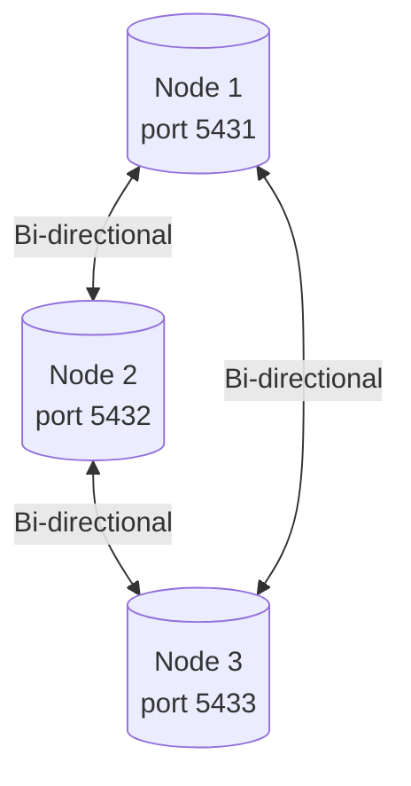

# Lab 02: 3-Node Full Mesh Multi-Master Setup

This lab demonstrates how to configure **pgEdge Spock** for a three-node full mesh active-active replication topology.

---

## 📐 Architecture Overview



In a full mesh topology, every node is directly connected to every other node in the cluster.
- Node 1 has subscriptions to Node 2 and Node 3.
- Node 2 has subscriptions to Node 1 and Node 3.
- Node 3 has subscriptions to Node 1 and Node 2.

All subscriptions use `forward_origins := '{}'` to prevent circular replication.

---

## 🧠 Scaling and Complexity of Full Mesh Topology

While full mesh replication provides excellent local latency (reads/writes are completed locally and synced asynchronously) and resilience (any node can fail, and the rest keep working), it has scaling limits:

1. **Quadratic Connection Growth**: The number of replication channels grows quadratically with the number of nodes $N$. The number of subscriptions is:
   $$S = N \times (N - 1)$$
   - For $N=2$: 2 subscriptions.
   - For $N=3$: 6 subscriptions (demonstrated here).
   - For $N=5$: 20 subscriptions.
   - For $N=10$: 90 subscriptions.
2. **Network Overhead**: Each node must manage connection pools, replication slots, and WAL senders/workers for all other nodes.
3. **Alternative Topologies**: For larger numbers of nodes, architectures such as **Hub-and-Spoke** (where spokes send to/receive from a central hub that forwards changes) are used. Spock supports this via setting `forward_origins` to `{all}` or specific origins on the hub.

---

## 🛠️ Step-by-Step Execution

You can run the entire lab lifecycle using the provided Makefile.

### 1. Start the Containers
Spins up three PostgreSQL nodes and waits for them to be healthy.
```bash
make up
```

### 2. Bootstrap Spock Replication
This step:
- Loads the Spock extension and creates the `devices` table on all three nodes.
- Registers each node inside its own database (Node 1 as `node1`, Node 2 as `node2`, Node 3 as `node3`).
- Adds the `devices` table to the `default` replication set on all three nodes.
- Connects the nodes in a full mesh by creating two bidirectional subscriptions per node (6 total).
```bash
make bootstrap
```

### 3. Verify Subscription Status
Verify that all 6 subscriptions are established and currently active:
```bash
make status
```

### 4. Run the Verification Script
Writes a record on Node 1 and verifies it propagates to Node 2 and Node 3. Then writes a record on Node 2 and verifies replication to 1 and 3. Finally, writes on Node 3 and verifies replication to 1 and 2.
```bash
make test
```

### 5. Tear Down the Lab
Stops the containers and wipes associated networks and volumes:
```bash
make down
```
